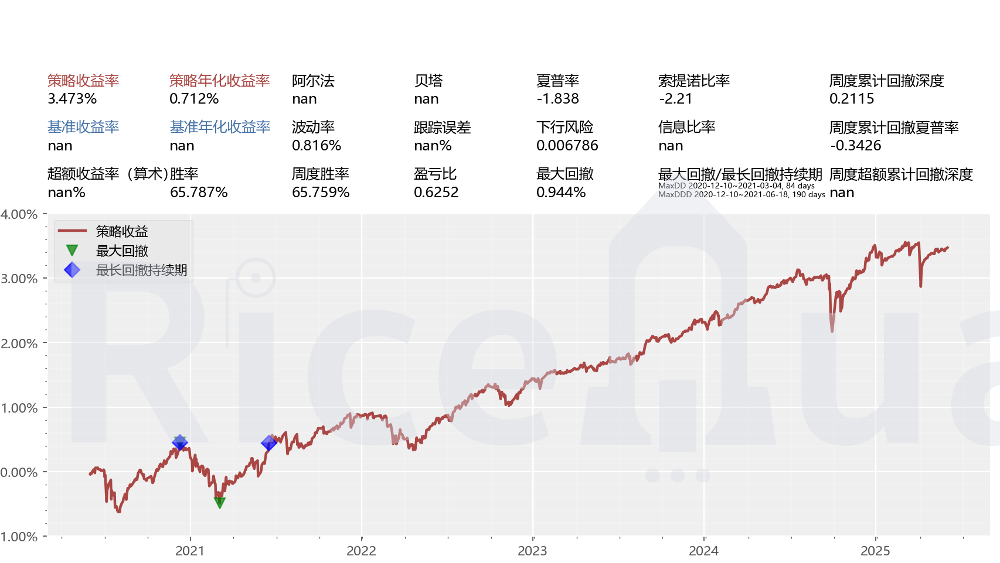

3. ### 环境、组件配置

   1. 装Ricequant SDK配件包
   
      ```bash
      pip install -i https://pypi.tuna.tsinghua.edu.cn/simple rqsdk
      ```
   
   2. 切换到已经装好 Ricequant SDK 的虚拟环境
   
   3. 在配置好Ricequant SDK的环境中通过下列命令来更新到最新的许可证
   
      ```bash
      rqsdk license
      ```
   
      该命令是交互式的，您只需要根据命令提示填入所需信息即可。配置完毕后可以调用`rqsdk license info`来查看刚配置的许可证信息。
   
   4. 安装回测引擎
   
      ```
      rqsdk install <安装代码>
      
      ```
   
      
   
   *注意：在安装某个产品时，如果上表中已说明组件依赖关系，则其所依赖的组建都会被同时安装上。例如运行了上述的命令安装了 RQAlpha Plus，那么 RQFactor 和 RQOptimizer 也会同时被装上。*
   
   
   
   ### 回测简易流程
   
   1. 更新基础数据（所有回测均需要用到，所以需要每次更新）和目标数据
   
   ```bash
   rqsdk update-data
   ```
   
   可通过rqsdk update-data --help 查看更新选项
   
   ```bash
   Usage: rqsdk update-data [OPTIONS]
   
   更新运行回测所需的历史数据
   
   例如:
   
   * 更新日线数据:  rqsdk update-data --base --enable-bjse
   
   * 更新股票、期权分钟数据:  rqsdk update-data --minbar stock --minbar option
   
   * 更新鸡蛋期货合约tick数据:  rqsdk update-data --tick JD
   
   * 更新豆粕1985及其合约的衍生品tick数据:  rqsdk update-data --tick M1905 --with-derivatives
   
   * 更新已下载的分钟线和tick数据:  rqsdk update-data --smart
   
   Options:
   
     -d, --data-bundle-path DIRECTORY
                                     bundle 目录，默认为 <用户目录>\.rqalpha-plus
     --base                          更新基础数据及日线，注意: 任何回测都需要依赖基础数据
     --minbar TEXT                   更新分钟线数据，可选的参数值有 [stock, futures, fund, index, option, convertible] 或
                                     underlying_symbol 或 order_book_id
     --tick TEXT                     更新tick数据，可选的参数值有 [stock, futures, fund, index, option, convertible] 或
                                     underlying_symbol 或 order_book_id
     --with-derivatives              更新分钟线和 tick 时同时更新选择的合约的衍生品数据
     -c, --concurrency INTEGER       并行的线程数量，需要低于 rqdatac 的最大可用连接数
     --smart                         检索本地已经存在的分钟线和 tick 数据，增量更新对应品种的数据和日线数据
     --rebuild                       将指定的合约 h5 文件从头进行更新，仅对 --minbar、--tick生效
     --help                          Show this message and exit.
   ```
   
   
   
   例如：更新回测基础数据及000001.XSHE的分钟线数据
   
   ```bash
   rqsdk update-data --base --minbar 000001.XSHE
   ```
   
   在上述命令执行完毕后，将会在`<用户目录>\.rqalpha-plus\bundle`目录下创建历史行情数据的缓存文件。
   
   *这是 Ricequant SDK 管理缓存文件的默认目录，您可以通过参数`-d <完整路径>`进行定制化。在回测时同样可以指定`-d`参数来更改 RQAlpha Plus 读取回测历史文件的位置。*
   
   2. 准备进行一次回测
   
   ```bash
   rqalpha-plus run -f 环境中策略文件所在文件夹/<策略文件名称>.py <-s 2018-01-01 -e 2018-12-31 -fq 1m --plot --account stock 100000>
   ```
   
   <...>中为参数配置 具体可用`rqalpha-plus run --help`命令查看，参数也可以直接在策略文件中`__config__`模块配置。
   
   可以用官方提供的样例策略尝试，策略编写、数据调取方法具体参照https://www.ricequant.com/doc/rqalpha-plus/tutorial.html RQAlpha Plus - 回测框架使用教程及https://www.ricequant.com/doc/rqalpha-plus/api/RQAlphaPlus API 手册
   
   
   
   
   
   ### 期权策略回测流程
   
   1. 环境、许可证配置
   
   2. 更新基础回测数据，标的数据和要用到的标的衍生品数据
   
      ```bash
      rqsdk update-data --base --minbar 000300.XSHG --with-derivatives
      ```
   
   3. 运行策略回测并可视化
   
      ```bash
      rqalpha-plus run -f examples/index_option_straddle.py -p
      ```
   
   
   在策略文件中添加logger.info()做策略的跟踪记录，部分输出示例：
   
   ```bash
   #记录合约
   [2020-12-29 09:45:00.000000] INFO: user_log: 合约IO2101C5100/IO2101P5000到期
   [2020-12-29 09:45:00.000000] INFO: user_log: 移仓完成 IO2101C5100 @行权价5100/IO2101P5000 @行权价5000
   [2020-12-29 09:45:00.000000] INFO: user_log: 今日开仓 IO2101C5100/IO2101P5000
   [2020-12-29 14:30:00.000000] INFO: user_log: 平今仓完成 IO2101C5100/IO2101P5000
   
   #事前风控
   [2021-01-15 09:45:00.000000] WARN: user_system_log: 订单被撤销：IO2102P5400 当前无成交量
   
   #主动/被动行权判断
   [2021-01-15 15:30:00.000000] INFO: user_system_log: 期权 IO2101C4950 到期，自动行权空方向 3 手
   [2021-01-15 15:30:00.000000] INFO: user_system_log: 期权 IO2101P4900 到期，行权价小于合约标的 000300.XSHG 当前价格，不进行自动行权，将从持仓中移除
   ```
   
   
   
   **约定函数**
   
   日级、分钟级、tick级频率的回测会在相同的时机触发盘外约定函数 `init`、`before_trading`、`after_trading` 和集合竞价约定函数 `open_auction`，而盘中约定函数 `handle_bar` 和 `handle_tick` 在不同频率的回测中的触发情况则有所不同。
   
   分钟回测适用于关注日内行情变动情况的策略，分钟回测会把交易时间按分钟切片，每个标的每分钟内的所有行情变动情况会被合成为一根具有高开低收等信息的分钟 k 线。
   
   分钟回测中盘中约定函数 `handle_bar` 会在每分钟**结束**时触发一次，在该函数中访问 `bar_dict` 参数可以获取到刚刚结束的一分钟的分钟 k 线。例如，股票策略在每个交易日的 9:31 会首次触发 `handle_bar`，此次触发的 `handle_bar` 中可以访问到的分钟线为 9:30-9:31 的分钟线。分钟回测中亦可以通过 [`history_bars`](https://www.ricequant.com/doc/rqalpha-plus/tutorial.html) 接口获取历史日 k 线。
   
   
   
   **分钟回测**
   
   分钟回测可以[设置撮合方式](https://www.ricequant.com/doc/rqalpha-plus/tutorial.html#撮合方式)为**立即使用当前分钟线的收盘价撮合**或**在下一分钟以下一个分钟线的开盘价撮合**。
   
   需要注意，因为不同品种的交易时间段不同，故需要策略告知 RQAlphaPlus 该策略关注的标的品种，以便 RQAlphaPlus 在正确的时间触发对应的 `handle_bar`：
   
   - 若用户配置了股票账户的资金账号，则 RQAlphaPlus 会在股票交易时间内触发 `handle_bar`，即 9:31 - 11:30 和 13:01 - 15:00。
   
   - 若策略交易期货、期权合约，则视具体策略（切换合约等逻辑）需要预先（在init或handle_bar中）使subscribe接口订阅所关注的合约，RQAlphaPlus 将会触发对应合约交易时间的handle_bar，subscribe的使用方法：
   
     ```python
     subscribe('RB2010')
     ```
   
   - 若订阅了多种交易时间不同的合约，或同时交易期货和股票，`handle_bar` 触发的时间段将是这些交易时间段的并集。
   
   - 若在 `handle_bar` 中从 `bar_dict` 获取当前**未在交易**的标的的 k 线，策略将会获取到“无效”的 [Bar 对象](https://www.ricequant.com/doc/rqalpha-plus/tutorial.html)，该对象所有字段的值均为 NaN。
   
   
   
   **事前风控**
   
   检测在实际交易中是否满足订单的撮合和发单交易逻辑
   
   RQAlphaPlus 中发出的订单在撮合前会经过多项事前风控，某项风控不通过会导致下单失败，部分事前风控可以自定义配置。
   
   - 验资风控：检验当前可用资金是否足够下单，默认开启。关闭该风控项可能导致剩余资金为负数
   
     - 命令行运行策略时，使用 `--no-cash-validation` 以关闭验资风控
   
     - 函数入口运行策略时，使用如下配置以关闭验资风控：
   
       ```python
       {"mod": {"sys_risk": {"validate_cash": False}}}
        
               Copied!
           
       ```
   
   - 验券风控：针对卖单（平仓单、行权单）检验当前可平仓位是否足够平仓
   
   - 自成交风控：针对新发订单，检验当前是否有方向相反的、存在和新发订单相互成交风险的挂单
   
     - 自成交风控默认关闭，通过命令行运行策略时，可以使用如下参数开启：
   
       ```bash
       -mc sys_risk.validate_self_trade true
        
               Copied!
           
       ```
   
     - 通过函数入口运行时，可以使用如下配置开启：
   
       ```python
       {"mod": {"sys_risk": {"validate_self_trade": True}}}
        
               Copied!
           
       ```
   
   - 债券发行总额风控：针对可转债订单，检验新发订单和已有持仓票面价值总和是否超过债券发行总额
   
   - 行权日期风控：检验行权日期是否合法，如欧式期权仅可在到期日行权，可转债仅可在转股期内转股、仅可在回售登记日期范围内回售
   
   
   
   **期权/期货发单接口**
   
   - buy_open：多头开仓，接受合约代码、交易数量、限价单价格（可选）为参数
   - sell_close：多头平仓，接受合约代码、交易数量、限价单价格（可选）、是否平今（可选）为参数
   
   ```python
   buy_open("RB2010", 2)
   
   sell_close("RB2010", 1, price=3100, close_today=True)
   ```
   
   - sell_open：空头开仓，参数与 `buy_open` 相同
   - buy_close：空头平仓，参数与 `sell_close` 相同
   
   具体参数设置可参照API文档
   
   https://www.ricequant.com/doc/rqalpha-plus/api/api/order_api.html
   
   
   
   **模拟撮合**
   
   使用函数入口运行时，使用如下的配置设置**撮合类型**：
   
   ```python
   # 设置撮合类型为当前 bar 收盘价撮合
   {"mod": {"sys_simulation": {"matching_type": "current_bar"}}}  
   ```
   
   所有可用的撮合方式如下：
   
   - `current_bar`：立即使用当前 k 线的收盘价作为参考价撮合，可在日回测和分钟回测中使用，该回测方式是 RQAlphaPlus 默认的撮合方式
   - `next_bar`：在下一个 `handle_bar` 触发前使用下一跟 k 线的开盘价撮合，可在分钟回测中使用
   - `last`：在下一个 `handle_tick` 触发前使用该 tick 的最新价撮合，可在 tick 回测中使用
   - `best_own`：在下一个 `handle_tick` 触发前使用该 tick 的己方最优报盘价格撮合，可在 tick 回测中使用
   - `best_counterparty`：在下一个 `handle_tick` 触发前使用该 tick 的对手方最优报盘价格撮合，可在 tick 回测中使用
   - `vwap`：成交量加权平均价撮合，可在日回测和分钟回测中使用
   
   
   
   使用函数入口运行时，使用如下的配置设置**滑点**：
   
   ```python
   # 成交价会产生千分之一的恶化
   {"mod":{"sys_simulation": {
       "slippage_model": "PriceRatioSlippage",
       "slippage": 0.001
   }}}
   ```
   
   可选的滑点模型如下：
   
   - `PriceRatioSlippage`：成交价格按照一定比例进行恶化，“滑点值” 即为价格恶化的比例
   - `TickSizeSlippage`：成交价按照最小价格变动单位进行恶化，价格恶化的值为“滑点值”乘以标的的最小价格变动单位
   
   
   
   **回测时账户设置**
   
   期权持仓分属股票（STOCK）和期货（FUTURE）账户，其中 ETF 期权属于股票账户，商品期权和股指期权属于期货账户。
   
   
   
   **行权方式**
   
   - 行权采用现金交割，即将行权产生的盈利或亏损直接计入现金中。
   - 主动行权：期权可通过 [`exercise` 接口 (opens new window)](https://www.ricequant.com/doc/rqalpha-plus/api/api/order_api.html#exercise)主动行权，该函数接收合约代码和行权数量两个参数
   
   ```python
   exercise("M1905C2350", 2)
   ```
   
   - 被动行权：期权持有至到期日将会触发自动行权。对于权利方（多头）持仓，若 RQAlphaPlus 判定行权可以盈利，则触发自动行权，否则仓位作废；而义务方（空头）持仓会在 RQAlphaPlus 判定对手方可以盈利时触发行权。
   
   - 行权滑点：为了模拟真实市场中行权委托与到账间这段时间段内底层标的价格发生波动带来的风险，RQAlphaPlus 提供了行权滑点功能，通过配置行权滑点，可以使得行权盈利的判定更为严苛。对于认购期权，0.1 的滑点代表即使在交割日标的价格降低 10%，本次行权仍然能盈利；而对于认沽期权，代表在交割日即使标的价格上涨 10%，仍然能盈利。默认行权滑点为 0 。行权滑点只会影响自动行权的判定，而不影响行权交割的金额。通过策略文件
   
     xxx.py种__config__模块设置
   
     ```python
     {"mod": {"option": {"exercise_slippage": 0.1}}}
     ```
   
     
   
     **权利金和保证金**
   
     - 权利方（多头）：开仓需要缴纳权利金，该过程与股票的开仓类似
     - 义务方（空头）：开仓会收取权利金并付出保证金，保证金会被冻结（类似期货开仓）；同时义务方也采取逐日盯市制度，每日盘后结算，浮盈浮亏将被计入现金。
   
   <u>***一、权利金（期权价格）的确定***</u>
   
   从表格中的 **`last_price` 列** 可以明确识别权利金：
   
   - 认购期权（如10009073 300ETF购5）
   
     2025/5/6 开仓价 `0.017`（即每份权利金为 `0.017元`）。
   
   - 认沽期权
   
     （如10009080 300ETF沽5）：
   
     2025/5/6 开仓价 `0.0248`（即每份权利金为 `0.0248元`）。
   
   **权利金计算逻辑**：
   
   - 每手权利金 =权利金 × 合约乘数（300ETF期权合约乘数为10,000
   
     例如：认购权利金 = `0.017 × 10,000 = 170元/手`。
   
   - 300手总权利金
   
     - 认购：`170 × 300 = 51,000元`
     - 认沽：`0.0248 × 10,000 × 300 = 74,400元`
   
   ------
   
   *<u>**二、保证金比例推算**</u>*
   
   **根据日志中 下单失败的资金缺口，反向推导保证金比例（假设为 沪深300ETF期权，交易所规则参考）：**
   
   1. 认购期权（行权价4.0）
   
   - **标的价格**：`3.866`
   
   - **权利金（每手）**：170
   
   - **虚值额**：`4.0 - 3.866 = 0.134`
   
     保证金公式（卖方）：
   
     保证金=权利金+max(标的现价×合约乘数×保证金比例−虚值额,最低保证金)
   
     - 实际需求保证金：`（1,059,450+390）元`（300手）→ 每手约 `3,532.8元`。<u>这里注意加上了下单所需手续费390</u>
     - 若忽略最低保证金，解算比例：3,532.8≈170+(3.866×10,000×*X*−0.134×10,000)**解得保证金比例 `X ≈ 12%`**
   
   2. 认沽期权（行权价3.8）
   
   - **虚值额**：`3.866 - 3.8 = 0.066`
   - **权利金（每手）**：248
   - 实际需求保证金：（`1,185,750+390元`）（300手）→ 每手约 `3,953.8元`。<u>这里注意加上了下单所需手续费390</u>
   - 反向推导：3,953.8≈248+(3.8×10,000×*X*−0.066×10,000)**解得保证金比例 `X ≈ 12%`**。
   
   （应该可以确定这里使用得保证金比例为12%，因为这里使用的标的价格存在四舍五入误差）
   
   
   
   
   
   **RQSDK支持自定义基准、出入金、管理费用等设置...**
   
   **策略内参数设置（函数运行入口）**
   
   使用命令行运行策略时，可以使用与函数入口运行策略时传入的 `config` 相同的格式编写配置，并把配置写在策略文件内。策略内参数配置的优先级低于命令行参数的优先级。
   
   策略内配置需要赋值给策略文件内的全局变量 `__config__`
   
   

**运行日内平值双卖策略**

```bash
rqalpha-plus run -f examples/index_option_straddle_optimized.py -p
```

**运行日内虚值一档双卖策略**

```bash
rqalpha-plus run -f examples/index_option_strangle_optimized.py -p
```

**运行日内delta中性双卖策略**

```bash
rqalpha-plus run -f examples/index_option_0delta_optimized.py -p
```

**运行日内300ETF期权虚值一档双卖策略**

```bash
rqalpha-plus run -f examples/ETF_option_strangle_optimized.py -p
```


日内平值双卖基础策略（每日开仓平仓）本金1000万，双边3手，故由于本金设置问题可以收益率仅供参考，主要看曲线



日内虚值一档双卖基础策略（每日开平仓）本金1000万，双边3手，故由于本金设置问题可以收益率仅供参考，主要看曲线


日内delta中性组合双卖（每日开平仓）本金1000万，双边3手，故由于本金设置问题可以收益率仅供参考，主要看曲线


